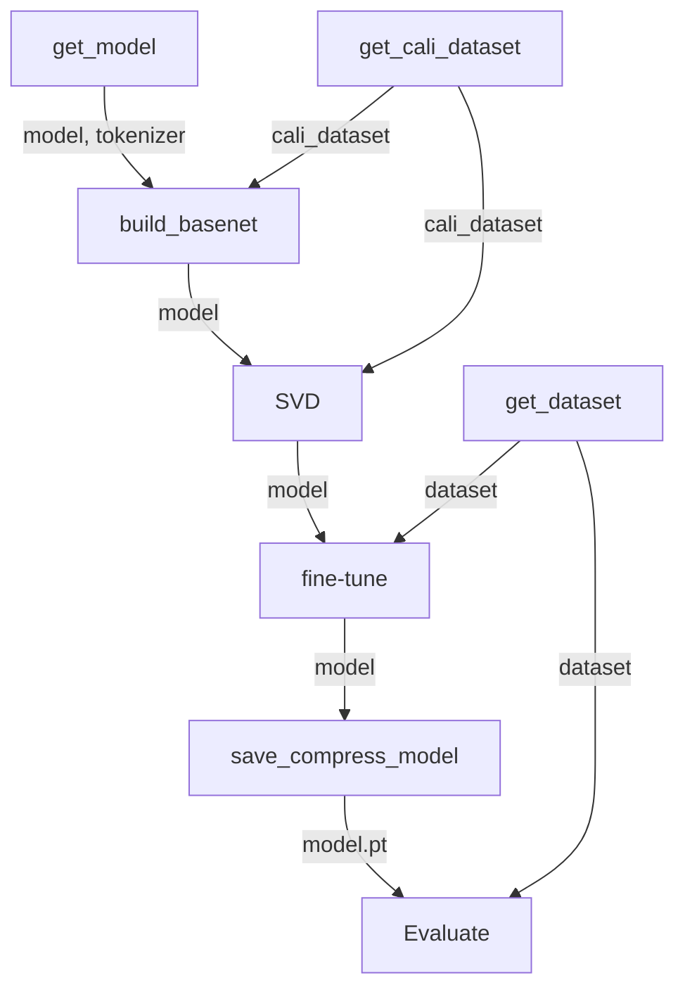

# SVD-MoE
svd-moe code

# Code structure

```mermaid
flowchart TB

    A[get_model] -->|model, tokenizer| E[build_basenet]

    C[get_cali_dataset] -->|cali_dataset| E

    C[get_cali_dataset] -->|cali_dataset| G[SVD]

    E -->|model| G[SVD]

    Q[get_dataset] -->|dataset| I

    Q[get_dataset] -->|dataset| M

    G -->|model| I[fine-tune]


    I -->|model| K[save_compress_model]

    K -->|model.pt| M[Evaluate]

```
